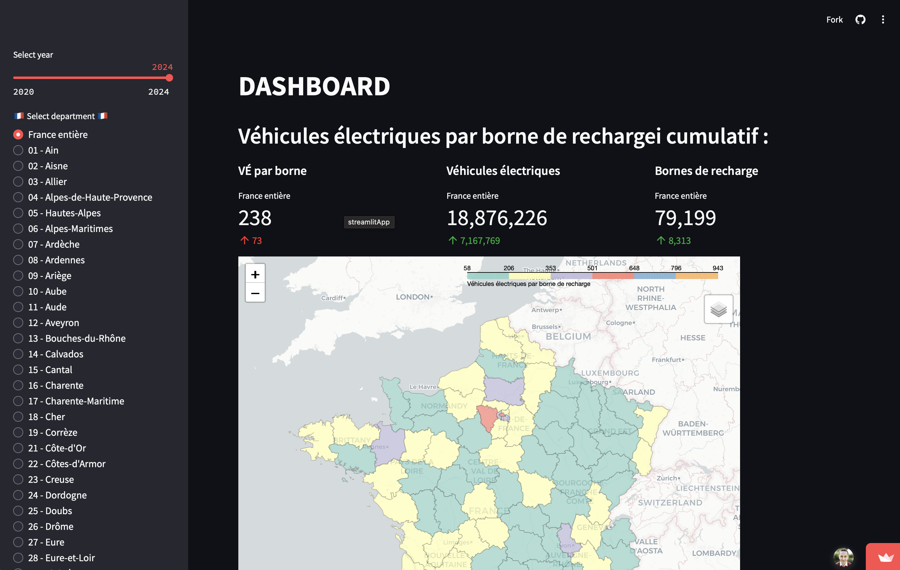

# Visualization Map Dashboard of Electric Vehicle Charging Stations 

_A Streamlit dashboard visualizing electric vehicle adoption and charging infrastructure across mainland France using open data._

---
</br>

## Overview

This project provides an [interactive visualization](https://ev-plug-in-france.streamlit.app/) of electric vehicle (EV) charging stations and EV adoption rates across the departments of mainland France.  
Built using Streamlit and Plotly, it was developed as part of an [Open Data University](https://www.opendatauniversity.org/) and [Latitudes France](https://www.latitudes.cc/) challenge.  
The dashboard aims to help users understand the distribution and growth of EV infrastructure by processing and presenting data sourced from [data.gouv.fr](data.gouv.fr).  
The target audience includes policymakers, researchers, and anyone interested in France's transition to electric mobility.

---
</br>

## Features

- Visualize the geographical distribution of EV charging stations across French departments on an interactive map.
- Display EV adoption trends over time using interactive charts.
- Utilizes Plotly for dynamic and interactive data visualizations.
- Processes and cleans complex datasets related to charging points and vehicle registrations.

---
</br>

## Tech Stack

| **Category**           | **Technologies**                                  |
|------------------------|---------------------------------------------------|
| Frontend/Visualization | `Streamlit`, `Plotly`, `streamlit-folium`         |
| Data Processing        | `Python`, `Pandas`                                |
| Data Sources           | `CSV`, `GeoJSON`                                  |
| Development Tools      | `Git`, `Python Virtual Environment (venv)`        |
| Deployment             | `Streamlit Community Cloud`                       |

---
</br>

## Screenshots

   

</br>

### Live Demo

The dashboard is hosted on Streamlit Community Cloud. It is accessible via [this link](https://ev-plug-in-france.streamlit.app/)  

---
</br>


## Lessons Learned

Key skills and insights gained during this project:

### Data Handling & Preprocessing:
- Cleanined and structured large (>100k rows), complex datasets with inconsistencies (missing values, varied formats).
- Applied **Pandas** for data manipulation, transformation (pivot tables), and merging diverse data sources.
- Addressed specific data challenges like standardizing regional codes (Corsica) and mapping geographical data (GeoJSON).

### Interactive Visualization:
- Built interactive dashboards using **Streamlit**.
- Created dynamic charts with **Plotly** for data insights.

### Technical Strategy & Problem Solving:
- Evaluated the feasibility (cost, reliability) of external APIs (Google Geocoding) for data enrichment.
- Adapted data acquisition and cleaning strategies based on evaluation results.

---
</br>

## Try it out!

Follow these steps to run the project locally:

### Prerequisites

* `Python 3.10+`
* `pip`
* `Git` (for cloning the repo)

### Installation & Setup

1.  **Clone the repo:**
    ```bash
    git clone https://github.com/svvoii/evs-charging-france-dashboard.git EV-Dashboard 
    cd EV-Dashboard # Navigate to the project directory
    ```
2.  **Create and activate a virtual environment:**
    ```bash
    python -m venv .venv
    source .venv/bin/activate  # Linux/Mac
    ```
3.  **Install dependencies:**
    ```bash
    pip install -r requirements.txt
    ```

### Data Setup

1.  Download the required datasets from their sources:
    * **Charging Points:** `charging_points.csv` from [data.gouv.fr](https://www.data.gouv.fr/fr/datasets/fichier-consolide-des-bornes-de-recharge-pour-vehicules-electriques/) 
    * **Electric Vehicles:** `voitures.csv` from [data.gouv.fr](https://www.data.gouv.fr/fr/datasets/voitures-particulieres-immatriculees-par-commune-et-par-type-de-recharge-jeu-de-donnees-aaadata/) 
    * **Corsica Postal Codes:** `code-postal-corse.csv` from [data.corsica](https://www.data.corsica/explore/dataset/code-postal-code-insee-2015/table/) 
    * **France Departments GeoJSON:** `france_departments.geojson` from [GitHub](https://github.com/gregoiredavid/france-geojson). (thanks to [gregoiredavid](https://github.com/gregoiredavid) for the GeoJSON file).  

2.  Place **all** downloaded files into a `data` folder in the root of the project directory. Ensure `charging_points.csv` and `voitures.csv` retain those exact names.


### Data Preprocessing

Run the preprocessing scripts to generate the pivot tables needed by the dashboard:
```bash
python epoints_preprocess.py 
python vehicles_preprocess.py 
```

This will create `epoints_pivot.csv`, `epoints_pivot_cumsum.csv`, `evs_pivot.csv`, and `evs_pivot_cumsum.csv` in the data folder.  

### Run the App
Launch the Streamlit application:

```bash
streamlit run map_dashboard.py
```

App should open in your default web browser at `http://localhost:8501`.  

---


## Author

[GitHub](https://github.com/svvoii) / 
[LinkedIn](https://www.linkedin.com/in/bocancia/) /
[Portfolio](https://sbocanci.me/) 

---